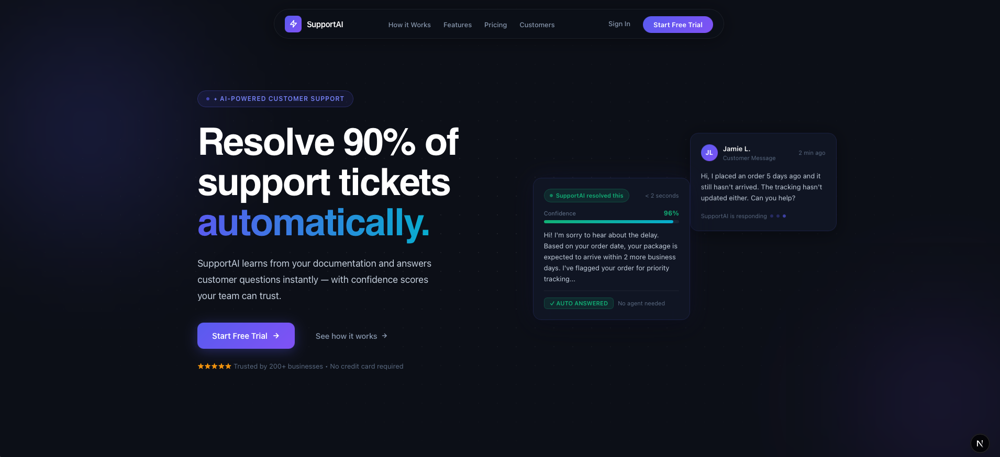
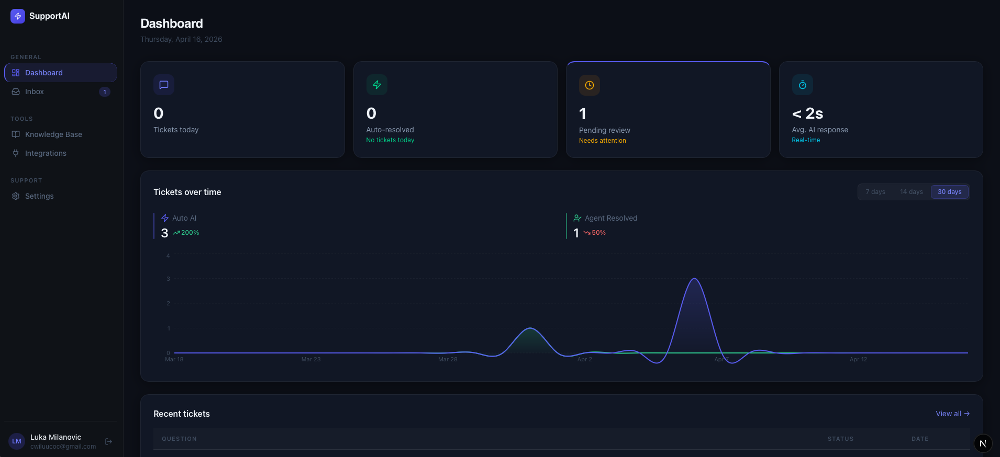
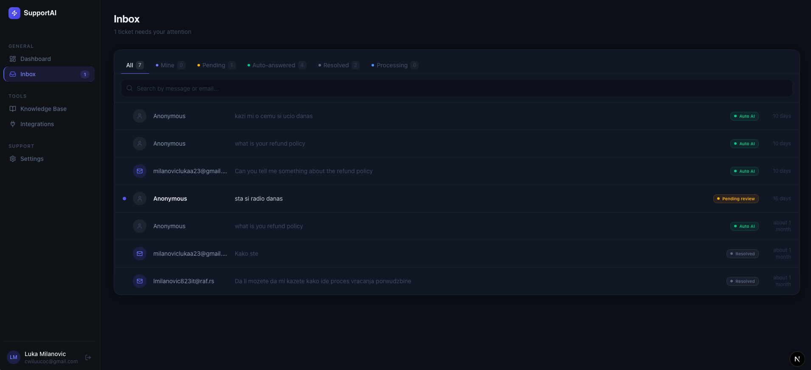
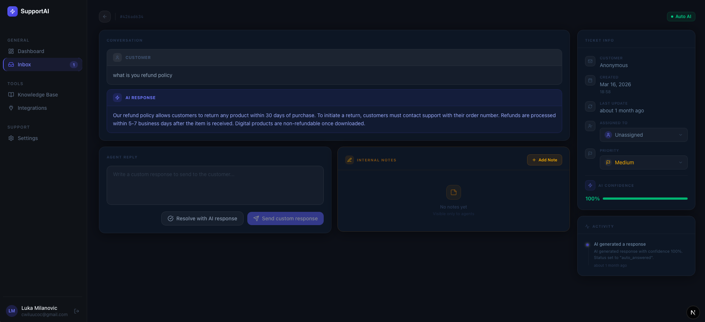
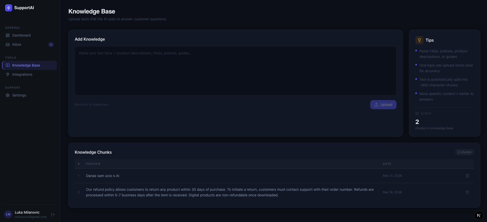
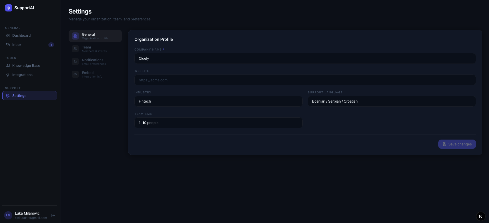

<div align="center">

# SupportAI

**AI-powered customer support ticketing system**

[](https://nextjs.org/)
[](https://nestjs.com/)
[](https://www.typescriptlang.org/)
[](https://supabase.com/)
[](https://openai.com/)
[](LICENSE)

</div>

---

## About the Project

**SupportAI** is a customer support management platform that combines a traditional ticketing system with artificial intelligence. The goal of the project is to enable companies to automatically answer frequently asked questions, while support agents can focus on more complex requests.

### What does the app do?

- Users can submit a problem or question via a **support form** (can be embedded on any website)
- The system automatically attempts to **answer the ticket using AI** based on the knowledge base entered by the team
- Agents get an **inbox** where they can see all tickets, assign them to colleagues, and track statuses
- The team can manage the **knowledge base** — adding articles and answers that the AI uses
- A **dashboard** is available with statistics and activity overview
- Support for multiple organizations with isolated data per team

---

## Screenshots

> Add application screenshots here

| Landing Page | Dashboard |
|:---:|:---:|
|  |  |

| Inbox | Ticket View |
|:---:|:---:|
|  |  |

| Knowledge Base | Settings |
|:---:|:---:|
|  |  |

---

## Tech Stack

### Backend
| Technology | Version | Role |
|---|---|---|
| NestJS | 11 | REST API framework |
| TypeScript | 5 | Programming language |
| Supabase | 2 | PostgreSQL database and authentication |
| OpenAI SDK | 6 | GPT-4o-mini and embeddings |
| Resend | 6 | Transactional email service |

### Frontend
| Technology | Version | Role |
|---|---|---|
| Next.js | 16 | React framework (App Router) |
| React | 19 | UI library |
| Tailwind CSS | 4 | Styling |
| shadcn/ui | latest | Components based on Radix UI |
| Recharts | 3 | Charts and statistics |
| Motion | 12 | Animations |

### Testing
| Tool | Role |
|---|---|
| Selenium + NUnit (C#/.NET 10) | End-to-end UI tests |
| Jest | Backend unit tests |
| Postman | API tests |

---

## Prerequisites

Before running the project, make sure you have the following installed:

- [Node.js](https://nodejs.org/) v20 or higher
- [npm](https://www.npmjs.com/) (comes with Node.js)
- [.NET SDK](https://dotnet.microsoft.com/download) v10 — only required for running Selenium tests

The following external services are also required:

- **Supabase** account and project — [supabase.com](https://supabase.com)
- **OpenAI** API key — [platform.openai.com](https://platform.openai.com)
- **Resend** API key (for emails) — [resend.com](https://resend.com)

---

## Installation & Setup

### 1. Clone the repository

```bash
git clone https://github.com/<your-username>/ai-support.git
cd ai-support
```

### 2. Install root dependencies

```bash
npm install
```

### 3. Configure environment variables

#### Backend

Create the file `backend/.env` and fill it in:

```env
PORT=3001
FRONTEND_URL=http://localhost:3000

# Supabase
SUPABASE_URL=https://xxxxxxxxxxxx.supabase.co
SUPABASE_ANON_KEY=your_anon_key
SUPABASE_SERVICE_ROLE_KEY=your_service_role_key
SUPABASE_JWT_SECRET=your_jwt_secret

# OpenAI
OPENAI_API_KEY=sk-...
OPENAI_EMBEDDING_MODEL=text-embedding-3-small
OPENAI_CHAT_MODEL=gpt-4o-mini

# Email (Resend)
RESEND_API_KEY=re_...
FROM_EMAIL=SupportAI <support@your-domain.com>

# Payments - Lemon Squeezy (optional)
LEMON_SQUEEZY_API_KEY=
LEMON_SQUEEZY_STORE_ID=
LEMON_SQUEEZY_WEBHOOK_SECRET=
```

#### Frontend

Create the file `frontend/.env.local` and fill it in:

```env
NEXT_PUBLIC_SUPABASE_URL=https://xxxxxxxxxxxx.supabase.co
NEXT_PUBLIC_SUPABASE_ANON_KEY=your_anon_key
NEXT_PUBLIC_API_URL=http://localhost:3001
```

### 4. Install dependencies

```bash
# Backend dependencies
cd backend && npm install && cd ..

# Frontend dependencies
cd frontend && npm install && cd ..
```

### 5. Run in development mode

#### Both services at once (recommended)

From the root directory:

```bash
npm run dev
```

This runs backend and frontend in parallel using `concurrently`.

#### Run separately

```bash
# Terminal 1 — backend (port 3001)
cd backend
npm run dev

# Terminal 2 — frontend (port 3000)
cd frontend
npm run dev
```

The application will be available at:
- **Frontend**: [http://localhost:3000](http://localhost:3000)
- **Backend API**: [http://localhost:3001](http://localhost:3001)

---

## Production

### Build

```bash
# Build backend
cd backend && npm run build

# Build frontend
cd frontend && npm run build
```

### Start

```bash
# Start backend
cd backend && npm run start:prod

# Start frontend
cd frontend && npm start
```

---

## Testing

### Unit tests (Jest — backend)

```bash
cd backend

# Run tests
npm run test

# Watch mode
npm run test:watch

# Coverage report
npm run test:cov
```

### End-to-end tests (Selenium — C#)

Tests cover the following scenarios:
- Login and registration
- Dashboard overview
- Inbox search
- Assigning tickets to agents
- Ticket notes

```bash
cd automated-tests
dotnet test
```

> **Note:** The application must be running locally before executing Selenium tests.

### API tests (Postman)

The `postman/` directory contains collections for testing API endpoints:

- `ai-support.postman_collection.json` — Full API tests
- `SupportAI_GoogleAuth_TicketFlow.postman_collection.json` — Auth and ticket flow
- `SupportAI_Notes.postman_collection.json` — Notes endpoint tests

Import the collections into Postman and set the `base_url` variable to `http://localhost:3001`.

---

## Project Structure

```
ai-support/
├── backend/                    # NestJS REST API
│   └── src/
│       ├── ai/                 # OpenAI integration
│       ├── ai-answer/          # AI response generation
│       ├── auth/               # JWT authentication
│       ├── tickets/            # Ticket CRUD operations
│       ├── knowledge/          # Knowledge base management
│       ├── organizations/      # Multi-organization support
│       ├── notes/              # Ticket notes
│       ├── profile/            # User profiles
│       ├── widget/             # Embeddable widget
│       ├── email/              # Email notifications
│       └── payments/           # Lemon Squeezy integration
│
├── frontend/                   # Next.js application
│   └── src/
│       ├── app/                # Next.js App Router pages
│       │   ├── auth/           # Login, register, password reset
│       │   ├── dashboard/      # Dashboard, inbox, settings
│       │   ├── submit/         # Public ticket submission form
│       │   └── ticket/         # Individual ticket view
│       ├── components/         # React components
│       ├── hooks/              # Custom React hooks
│       └── lib/                # API clients and helpers
│
├── automated-tests/            # C# Selenium tests
│   └── automated-tests/
│       ├── Tests/              # Test classes
│       └── Pages/              # Page Object Model classes
│
├── postman/                    # Postman collections
├── .github/workflows/          # GitHub Actions CI/CD pipeline
└── package.json                # Root monorepo configuration
```

---

## CI/CD

The project uses **GitHub Actions** for automated code verification.

The pipeline is triggered on every push and pull request to the `main` branch:

1. **Build backend** — Compiles the NestJS application
2. **Build frontend** — Creates the Next.js production build
3. **Selenium tests** — Runs E2E tests in a browser environment

---

## Available Scripts

### Root

| Command | Description |
|---|---|
| `npm run dev` | Runs backend and frontend simultaneously |

### Backend (`cd backend`)

| Command | Description |
|---|---|
| `npm run dev` | Development server with hot-reload |
| `npm run build` | Compiles TypeScript |
| `npm run start:prod` | Production start |
| `npm run test` | Run Jest tests |
| `npm run test:cov` | Tests with coverage report |
| `npm run lint` | ESLint check and auto-fix |

### Frontend (`cd frontend`)

| Command | Description |
|---|---|
| `npm run dev` | Development server on port 3000 |
| `npm run build` | Production build |
| `npm start` | Run production build |
| `npm run lint` | ESLint check |

---

## License

This project is licensed under the [MIT License](LICENSE).
